## Часть 1 Получение метрик и логов

### Написание сборщиков метрик

Добавление micrometer в pom.xml

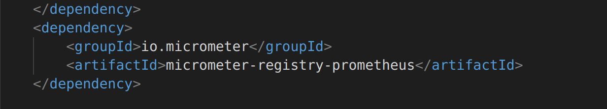

Добавление настроей в aplication.config

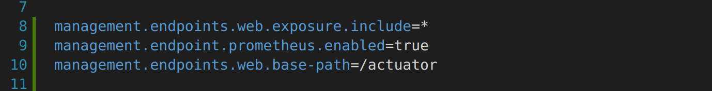

Пример добавления счётчика в код 

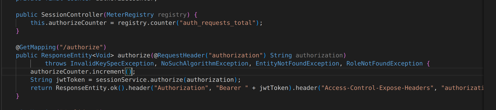

Вывод полученных метрик в prometheus

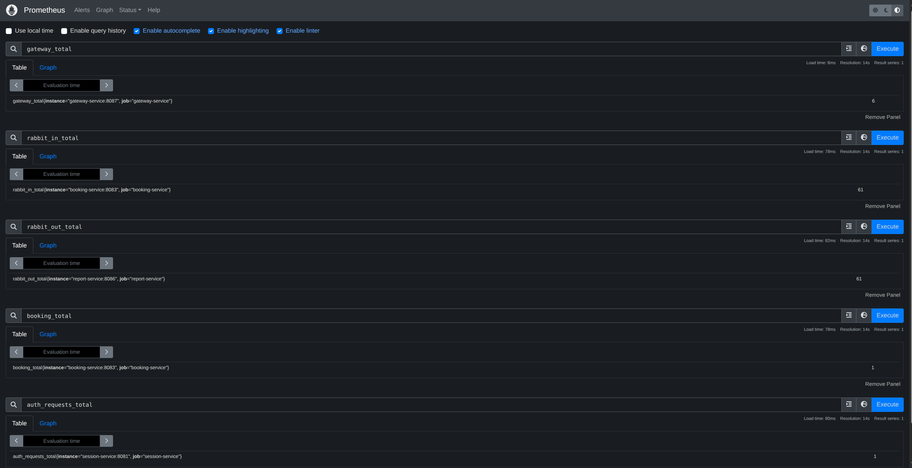

### Добавление стека мониторинга в docker-compose

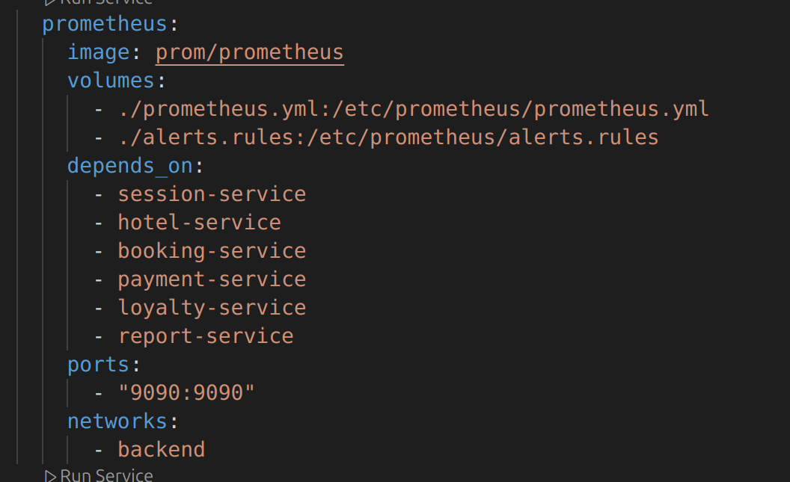
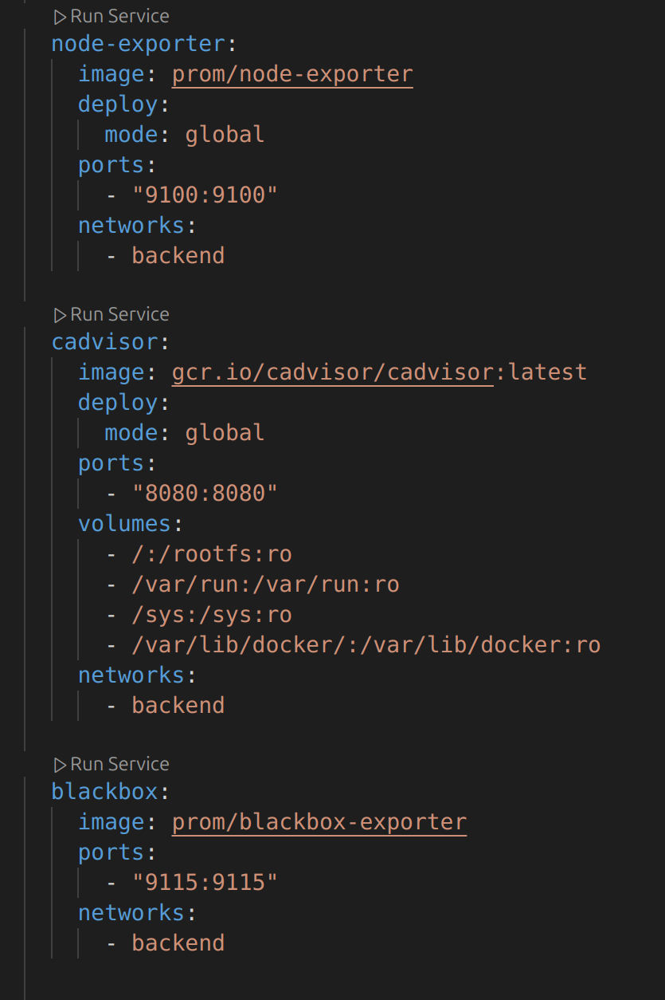
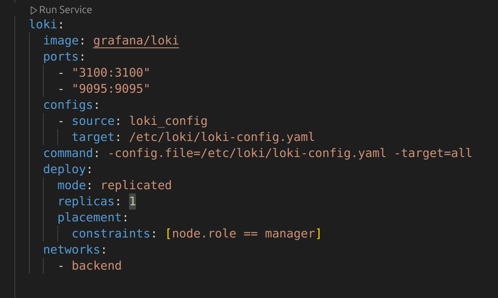

Просмотр сборщиков метрик

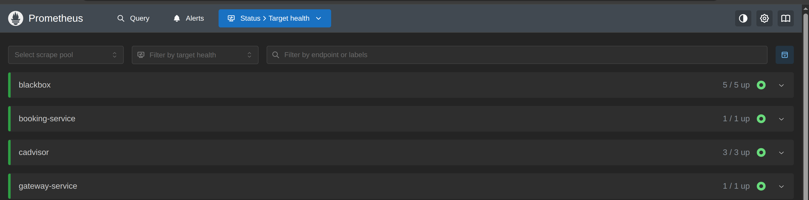
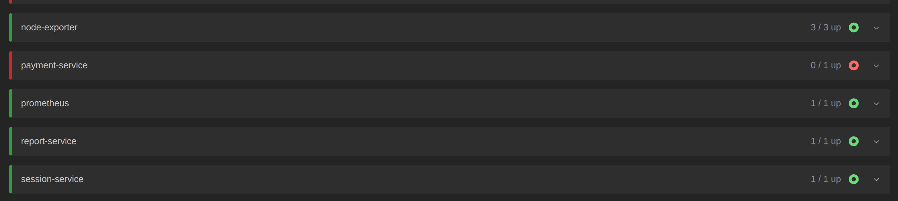

## Часть 2 Визуализация

Добавление Grafana

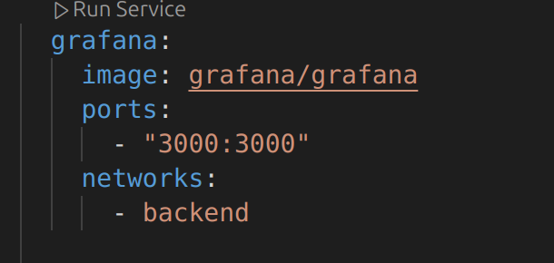

Подключенные data sourses

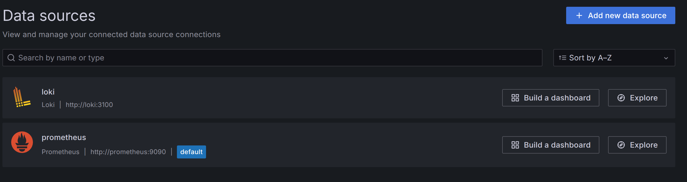

Dashbord с метриками

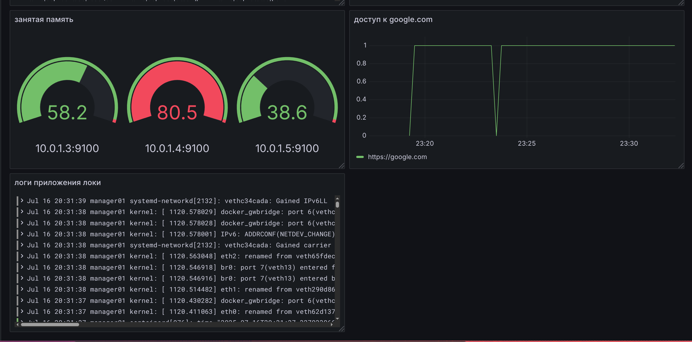
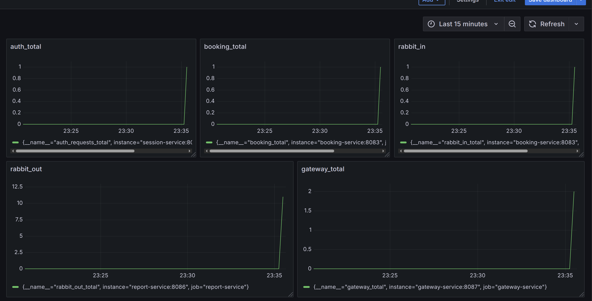
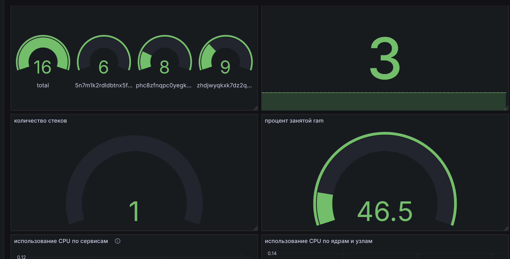
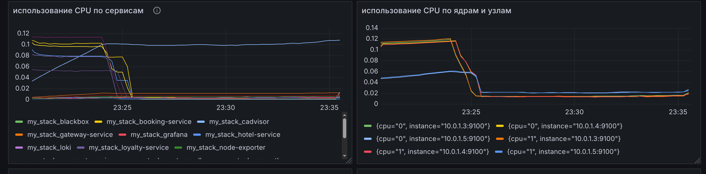

## Часть 3 Отслеживание критических событий

Добавление Alert Manager

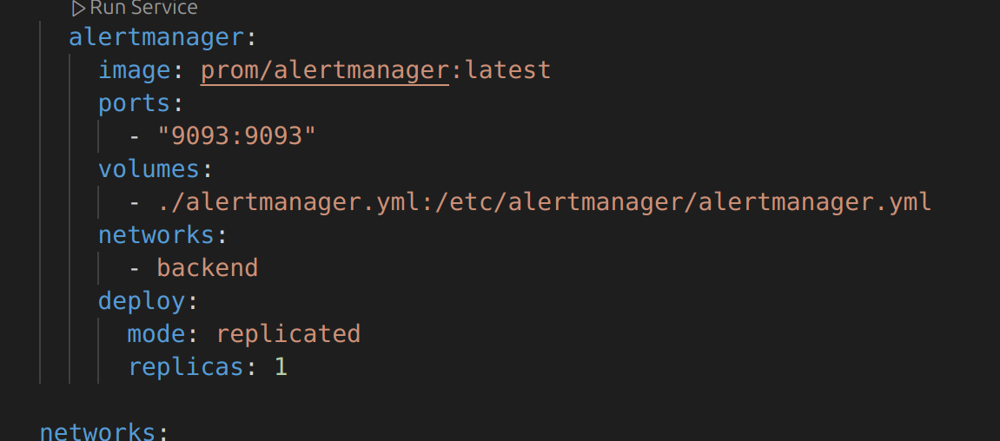

Настройки отслеживания критических событий

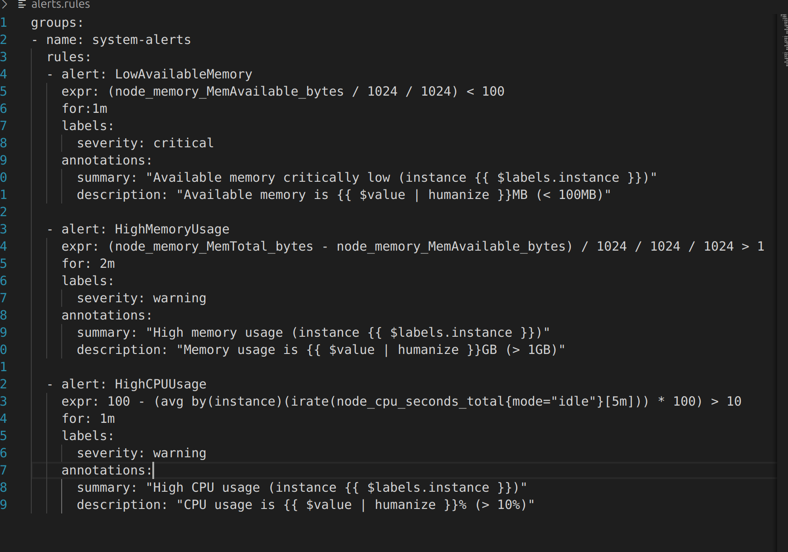

Отображение alert manager в prometheus

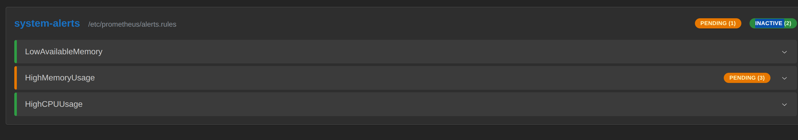

Имитация нагрузки

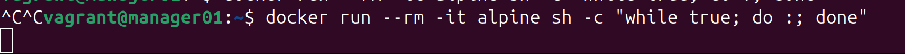

Срабатывание оповещения

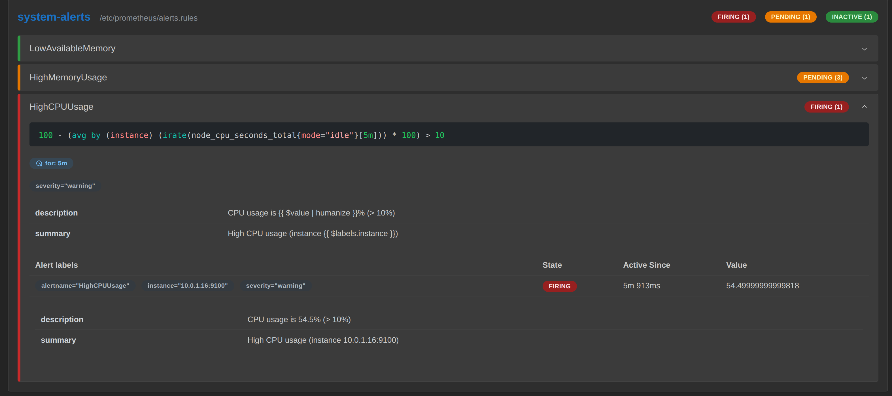
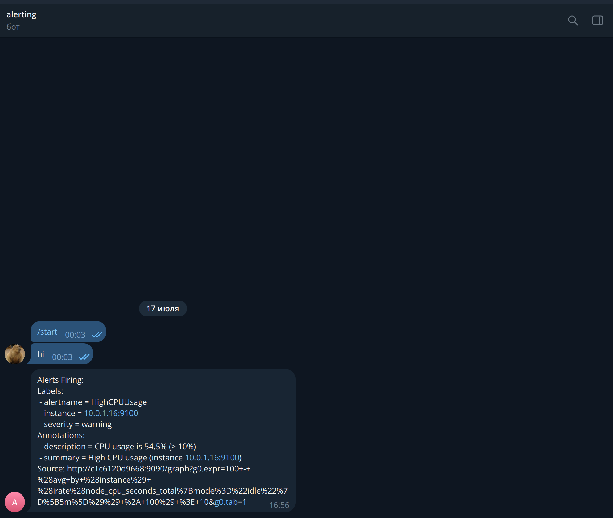

Сообщение о стабилизации
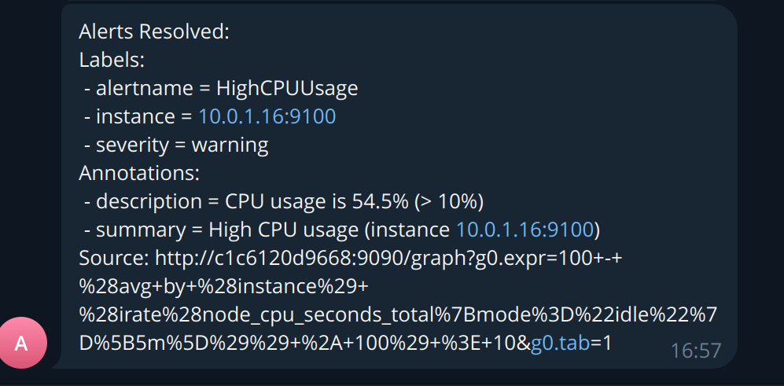

Сообщение о ram > 1gb

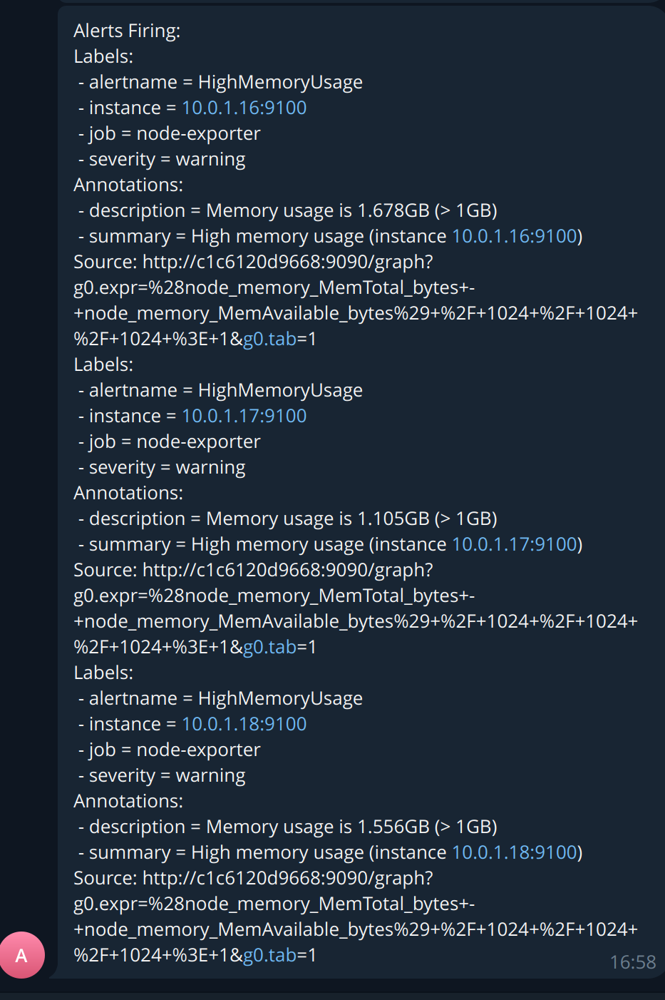
